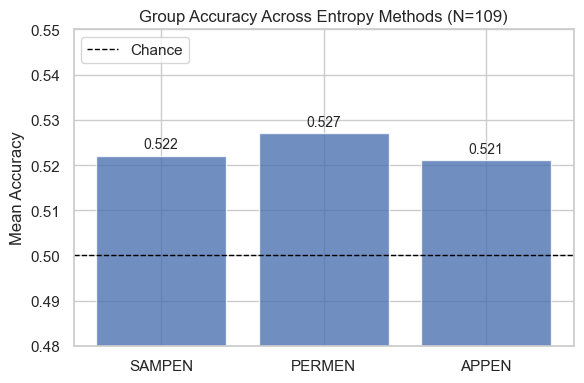
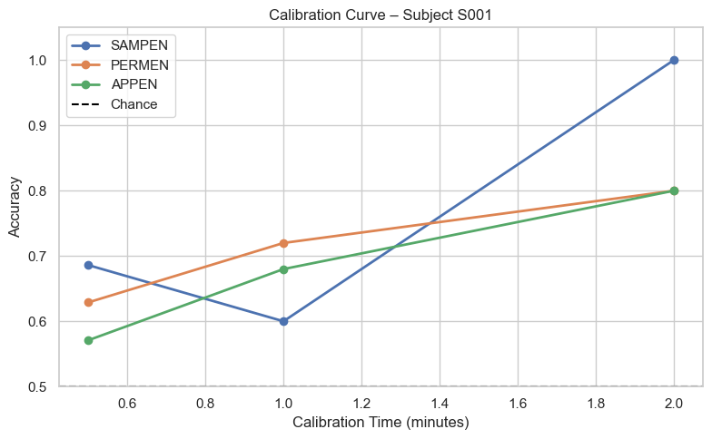
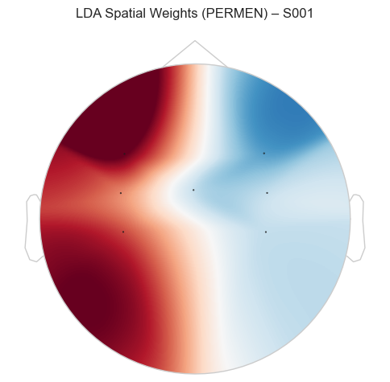
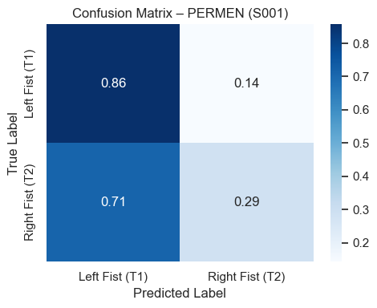

# EEG BCI Motor Imagery Classification using Entropy Features

This project for the Biomedical Signal Analysis course, BME772, implements a Brain-Computer Interface (BCI) pipeline to classify Motor Imagery (MI) tasks (specifically imagining opening and closing the left vs. right fist) using Electroencephalography (EEG) signals.

The core focus of this analysis is comparing different **Entropy-based feature extraction methods** (Sample, Permutation, and Approximate Entropy) combined with Linear Discriminant Analysis (LDA) to distinguish between motor states.

## 📂 Dataset

This project uses the **PhysioNet EEG Motor Movement/Imagery Dataset (EEGMMI)**.

- **Source:** [https://physionet.org/content/eegmmidb/1.0.0/](https://physionet.org/content/eegmmidb/1.0.0/)
- **Tasks:** The script focuses on **Task 2** (Runs 4, 8, 12): Imagine opening and closing left or right fist.
- **Subjects:** Analyzes subjects 1 through 109.

## ⚙️ Methodology

### 1. Preprocessing
The pipeline utilizes `mne` for signal processing:
- **Channel Selection:** Focuses on the motor cortex (`FC3`, `C3`, `CP3`, `FC4`, `C4`, `CP4`, `Cz`).
- **Spatial Filtering:** Applies **Current Source Density (CSD)** to reduce volume conduction and sharpen spatial resolution.
- **Temporal Filtering:** Band-pass filter (1–40 Hz).
- **Epoching:** Extracts 3-second epochs for Left vs. Right imagery trials.

### 2. Feature Extraction
Features are extracted from the **Motor Band (8–30 Hz)** using the `antropy` library. Three distinct entropy metrics are evaluated:
1. **Sample Entropy (`sampen`):** Measures the complexity of the time-series.
2. **Permutation Entropy (`permen`):** Measures the information contained in comparing neighboring values (order statistics).
3. **Approximate Entropy (`appen`):** Quantifies the unpredictability of fluctuations.

### 3. Classification
- **Model:** Linear Discriminant Analysis (LDA) with automatic shrinkage (LSQR solver).
- **Validation:** Stratified 5-Fold Cross-Validation.

## 📊 Results & Visualizations

### Group Accuracy Comparison
A comparison of the mean accuracy across 109 subjects for all three entropy methods.



### Calibration Curve (Subject S001)
This analysis demonstrates the "zero-training" potential of the system. It plots accuracy as a function of calibration time (amount of training data collected). Permutation Entropy shows strong performance even with minimal calibration data.



### Spatial Weight Distribution (Permutation Entropy)
The topological map below visualizes the spatial weights assigned by the LDA classifier. The red and blue regions correspond to the activation of the contralateral motor cortex areas (C3 and C4) during left vs. right hand imagery, confirming physiologically plausible feature extraction.



### Confusion Matrix (Subject S001)
A normalized confusion matrix showing the classification performance for Permutation Entropy on the demo subject.



## 🛠️ Installation

To run this project, you need Python installed along with the following dependencies:

```bash
pip install numpy matplotlib seaborn scikit-learn mne antropy
